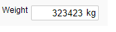

### Object: Show a unit next to an input


<p align="left">
  
</p>

To show a unit (e.g. kg) to the right of an input object, add this css in the Setup -> Header field between the <style> tags.


```css
.input_with_appended_unit input {
  padding-right: 22px;
  text-align: right
}
.input_with_appended_unit span {
  position: absolute;
  font-family:"Helvetica Neue",Helvetica,Arial,sans-serif
}
```

☛ Add this JavaScript Code to your form’s Custom Code field:

❓ [How to add Custom Code](/codelib/common/form_add_custom_code_javascript.gif)

```javascript
function nuAddUnitToInput(id, unit, top = 3, left = 8) {
    let obj = $("#" + id);
    obj.wrapAll('<div class="input_with_appended_unit"></div>');
    let objUnitId = id + '_' + unit;
    obj.after('<span id =' + objUnitId + '>' + unit + '</span>');

    $('#' + objUnitId).css({
        "top": obj.cssNumber("top") + top,
        "left": obj.cssNumber("left") + obj.cssNumber("width") + left,
        "font-size": obj.cssNumber("font-size")
    });
}
```

#### ✪ Example

To add kg to an Input, call this JavaScript when the form is loaded:


```javascript
if (nuFormType() == 'edit') {
   nuAddUnitToInput('Replace_with_your_Input_object_ID', 'kg')
}  
```
